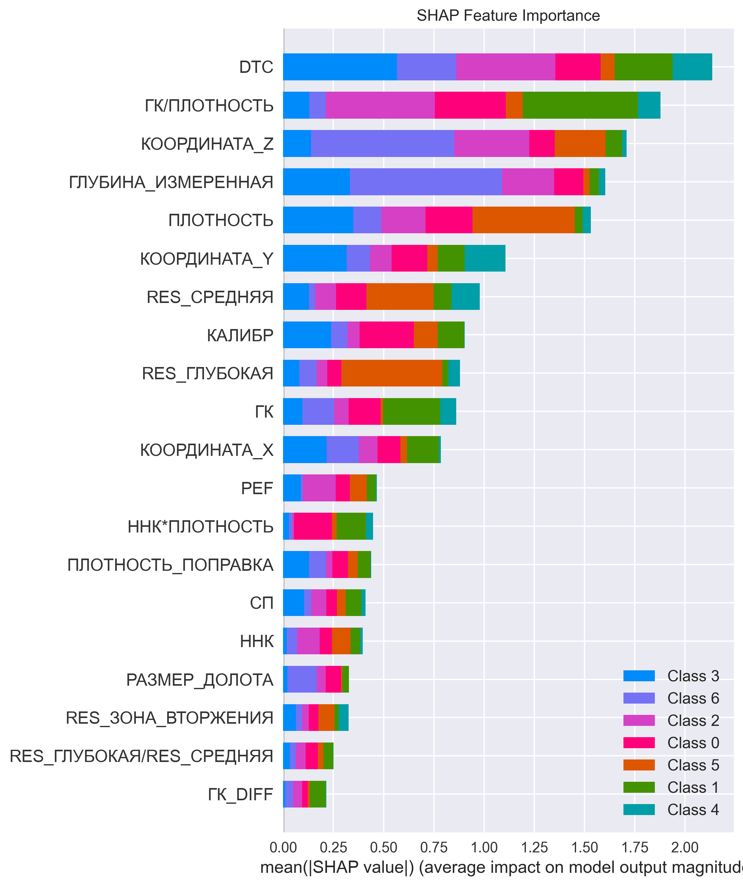

# well-log-lithology-classification
# 🪨 Классификация литологии по данным ГИС

Machine Learning модель для автоматического определения типа горной породы по данным геофизических исследований скважин (ГИС). Проект демонстрирует применение современных методов машинного обучения для решения практических задач в нефтегазовой отрасли.

## 🎯 Задача

**Мультиклассовая классификация** 12 типов литологии по данным стандартного каротажного комплекса. Модель предсказывает тип горной породы на основе геофизических измерений.

## 📊 Данные

Данные взяты из открытого конкурса [FORCE 2020 Machine Learning competition](https://github.com/bolgebrygg/Force-2020-Machine-Learning-competition):

- **Целевая переменная:** `ЛИТОЛОГИЯ` (12 классов горных пород)
- **Признаки:** Стандартные методы каротажа (ГК, RES, ННК, ПЛОТНОСТЬ, DTC и др.)
- **Объем:** ~400,000 измерений из multiple скважин
- **Особенности:** Реальные данные с пропусками, требующие тщательной предобработки

### Классы литологии:
- Песчаник, Песчаник-Глина, Глинистый песчаник
- Известняк, Мергель, Известковистая глина  
- Доломит, Мел, Глина, Туф, Песчанистый известняк, Ангидрит

## 🛠 Стек технологий

- **Язык:** Python 3.8+
- **Библиотеки ML:** Scikit-learn, XGBoost, SHAP
- **Анализ данных:** Pandas, NumPy
- **Визуализация:** Matplotlib, Seaborn
- **Инструменты:** Jupyter Notebook, Git

## 🚀 Ключевые результаты

- **Accuracy на тестовой выборке:** 90.3%
- **Лучшая модель:** XGBoost Classifier
- **Главный инсайт:** Feature engineering и SHAP-анализ показали, что созданные геофизические отношения (`ГК/ПЛОТНОСТЬ`, `ННК*ПЛОТНОСТЬ`) вошли в топ-5 по важности, что подтверждает осмысленность модели с точки зрения геофизики.

## 📈 Особенности реализации

### 🔧 Feature Engineering
Созданы специализированные геофизические признаки:
- Отношения каротажных параметров (`ГК/ПЛОТНОСТЬ`, `RES_ГЛУБОКАЯ/RES_СРЕДНЯЯ`)
- Скользящие статистики (`ГК_МА`, `ПЛОТНОСТЬ_STD`)
- Производные разности (`ГК_DIFF`, `ПЛОТНОСТЬ_DIFF`)

### 🧠 Интерпретируемость модели
Проведен SHAP-анализ для понимания вклада признаков:

### ⚡ Оптимизация
- Отбор наиболее значимых признаков
- Подбор гиперпараметров XGBoost
- Стратифицированное разделение на train/test

## 🏃 Как запустить

1. Клонируйте репозиторий:
git clone https://github.com/your-username/well-lithology-prediction.git
cd well-lithology-prediction

2.Установите зависимости:
pip install -r requirements.txt

3.Запустите основной ноутбук:
jupyter notebook lithology_classification.ipynb

4.Или запустите скрипт:
python lithology_classification.py

### 🧠 Структура проекта
text
well-lithology-prediction/
├── lithology_classification.ipynb    # Основной рабочий ноутбук
├── lithology_classification.py       # Скриптовая версия
├── requirements.txt                  # Зависимости Python
├── README.md                         # Этот файл
├── data/                            # Папка для данных (автоскачивание)
├── images/                          # Графики и визуализации
│   ├── shap_feature_importance.png
│   └── confusion_matrix.png
└── results/                         # Результаты и метрики

### 🧠 Business Value
Проект демонстрирует возможность:
Автоматизации интерпретации ГИС
Сокращения времени анализа с недель до часов
Повышения точности определения литологии
Стандартизации процесса интерпретации между различными специалистами

👨‍💻 Автор
[Дамир_Латыпов] - Data Scientist с фокусом на применении ML в нефтегазовой отрасли

