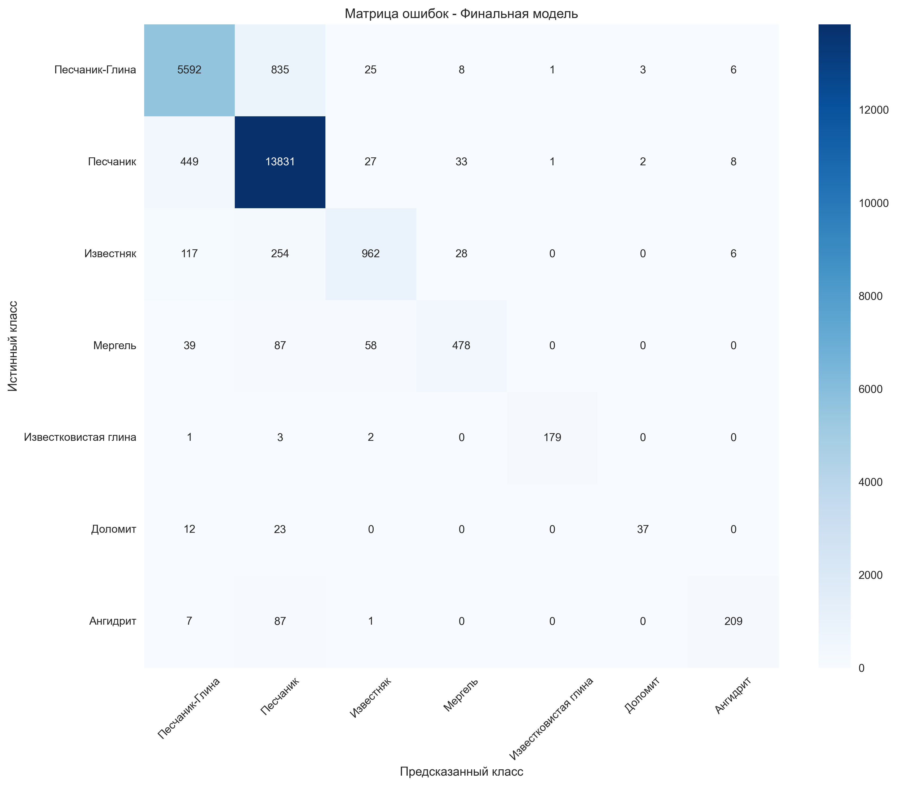
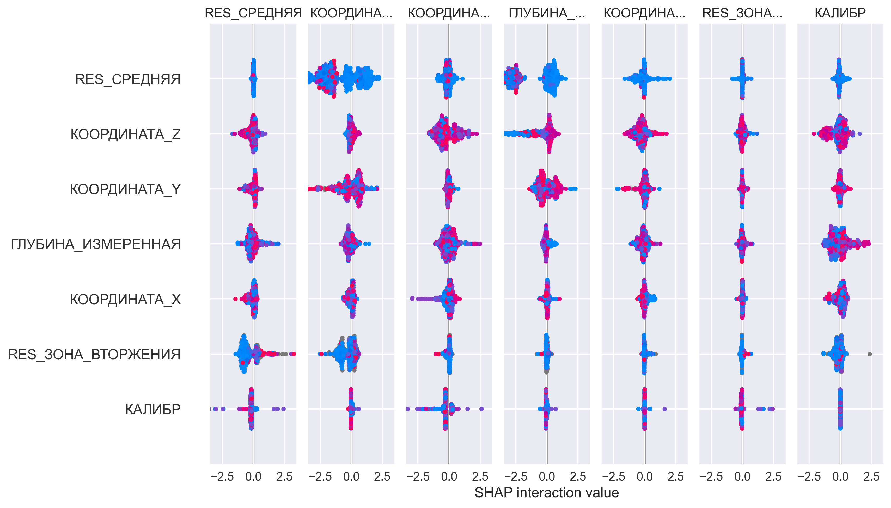

# 🪨 Классификация литологии по данным ГИС (XGBoost + SHAP)

Проект по автоматизации определения литологии по данным геофизических исследований скважин (ГИС).  
Используются алгоритмы машинного обучения и интерпретируемость моделей (SHAP) для повышения качества геологических решений.

---

# 🎯 Цель проекта

Создать модель, которая автоматически определяет **литологию пласта** на основе набора каротажных кривых.  
Проект ориентирован на применение в нефтегазовой индустрии:

- ускорение интерпретации ГИС;
- уменьшение зависимости от человеческого фактора;
- автоматизация рутинных операций геолога / петрофизика;
- улучшение качества отбора интервалов для исследований.

---

# 📊 Результаты

- **Финальная точность (Accuracy): 0.909**
- **Финальный F1-score: 0.830**
- Модель оптимизирована по важности признаков
- Выполнен анализ пропусков, распределений, важности признаков
- Использованы методы интерпретации (SHAP)

---

# 🧠 Используемые технологии

- Python 3.10+
- Pandas, NumPy
- Scikit-learn
- XGBoost
- SHAP
- Matplotlib, Seaborn

---

# 📁 Структура проекта

```

.
├── data/                     # Данные ГИС
│   └── .gitkeep
├── images/                   # Графики и визуализации
│   ├── confusion_matrix.png
│   ├── feature_distributions.png
│   ├── feature_importance.png
│   ├── lithology_distribution.png
│   ├── shap_feature_importance.png
│   └── shap_summary_plot.png
├── models/
│   └── .gitkeep
├── results/                  # Метрики и json-отчёты
│   ├── feature_importance.csv
│   ├── final_results.json
│   ├── lithology_statistics.csv
│   └── missing_values_analysis.csv
├── lithology_classification.py
├── data_description.md
├── requirements.txt
└── README.md

````

---

# 📈 Визуализации

### 📌 Матрица ошибок


### 📌 Важность признаков


### 📌 SHAP summary plot


---

# 🔍 Интерпретируемость модели (SHAP)

Модель дополнена анализом SHAP:

- определены ключевые признаки, влияющие на решение;
- подготовлены summary plot, bar plot и распределения SHAP-значений;
- выявлены особенности поведения модели в разных литотипах.

---

# 🧪 Как запустить

### 1. Клонировать репозиторий

```bash
git clone https://github.com/damir-latypov/well-log-lithology-classification.git
cd well-log-lithology-classification
````

### 2. Установить зависимости

```bash
pip3 install -r requirements.txt
```

### 3. Запустить обучение модели

```bash
python3 lithology_classification.py
```

После запуска появятся:

* все графики → `images/`
* все метрики → `results/`
* результаты в терминале

---

# 💼 Бизнес-ценность

### Для нефтегазовых компаний:

* автоматизация интерпретации ГИС;
* сокращение времени построения геомоделей;
* рост стабильности и повторяемости решений;
* инструмент для цифровизации петрофизики.

### Для геологов и петрофизиков:

* быстрый анализ пластов;
* подсказки модели по интервалам;
* возможность интеграции в ППД/ГДИС-workflow.

---

# 👨‍💻 Автор

**Дамир Латыпов**
Data Scientist / ML Engineer
Экспертиза: геология, ГИС, машинное обучение в нефтегазе

GitHub: [https://github.com/damir-latypov](https://github.com/damir-latypov)
Email: [damir_latypov_98@mail.ru](mailto:damir_latypov_98@mail.ru)

---

# 📄 Лицензия

MIT License
